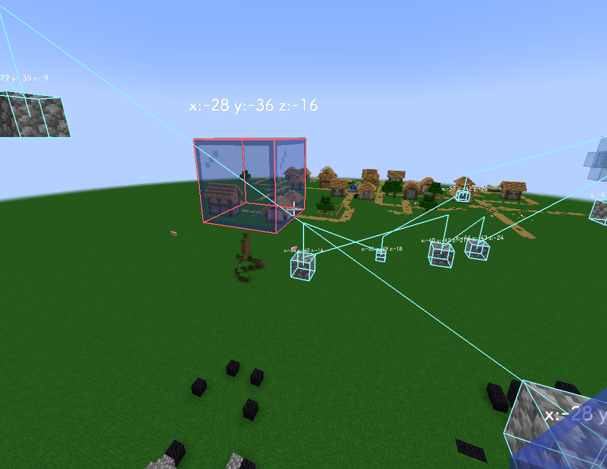

# GemstoneMarco
## 选项
### waypoint
- 类型 `WaypointSelect`
  - 过滤器 `CM_`
- 默认 `无`
- 描述 `一个路径点选择器，确保你的路径点以 CM_ 开头`
- 
### aotv
- 类型 `SkyBlockItemSelector`
  - 过滤器 `aotv`
  - 选择器 `best aotv`
- 默认 `无`
- 描述 `你的 Aspect of the end/void 槽位`

### tool
- 类型 `SkyBlockItemSelector`
  - 过滤器 `miningTool`
  - 选择器 `无`
- 默认 `无`
- 描述 `你的 挖掘工具槽位 槽位`

### weapon
- 类型 `SkyBlockItemSelector`
    - 过滤器 `weapon`
    - 选择器 `无`
- 默认 `无`
- 描述 `你的 武器 槽位`

### escape
- 类型 `toggleswitch`
- 默认 `false`
- 描述 `是否开启逃逸`

### escapeLevel
- 类型 `toggleswitch`
  - 范围 `0 ~ 4`
- 默认 `4`
- 描述 `逃逸级别`

### rotation
- 类型 `toggleswitch`
- 默认 `true`
- 描述 `当你的视角或位置被移动 escapeLevel>0`

### closing
- 类型 `toggleswitch`
- 默认 `true`
- 描述 `当有人快速接近你 escapeLevel>2`
- 
- ### look
- 类型 `toggleswitch`
- 默认 `true`
- 描述 `当有人总是看着你 escapeLevel>3`

### breakNode
- 类型 `toggleswitch`
- 默认 `true`
- 描述 `当有你的节点被破坏 escapeLevel>0`

### entity
- 类型 `toggleswitch`
- 默认 `true`
- 描述 `当你瞄准一个实体 escapeLevel>2`

## 如何开始？
1. 在开始前使用命令`/wp add CM_yourname1`创建路径点组
2.  选择你创建的路径点组后站在第一个路径点上按 `H` **_第一个路径点始终会被标记为绿色_**
3.  如果路径点有遮挡则无法开启 并且你的视角会指向它

## 杂项
### 可能发送的东西
- If you are already to go,press the key [H]!
- You are facing an entity!
- Your node has been ruined!
- You are rotated by the server!
- Someone always look at you!
- After starting the marco,please clear the block that stands in the way!
- Start!
- Press the key [H] to start again!
   

